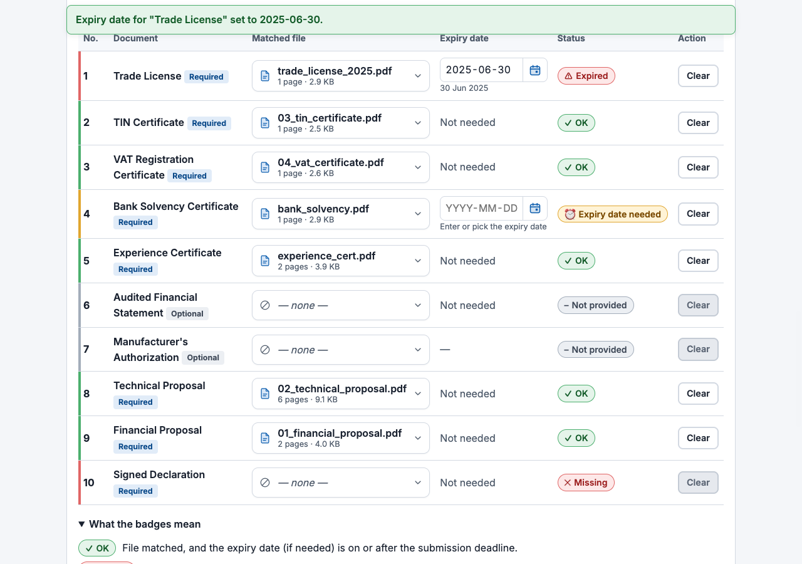

# Tender Package Builder · টেন্ডার প্যাকেজ বিল্ডার

AI DevFest 2026 Vibe Coding contest entry. Problem: **Tender Document Package Builder**.

## Name & Registration No.

- **Name:** Sharif Rafid Ur Rahman
- **Registration No.:** VC002-242-15-480

## Live Link

**https://sharifrafid.github.io/devfest-VC002-242-15-480/** (GitHub Pages, HTTPS, no login)

## Organization Use Case

Built for the tender/procurement office of a bidding company: staff turn a pile of PDFs into one complete, checked, correctly ordered bid package, so a submission is never rejected for a missing, expired, duplicated or misplaced document.

## How to Run

1. **Live:** open the live link in the latest Google Chrome.
2. **Locally:** ES modules do not run from `file://`, so serve the folder:
   ```bash
   python3 -m http.server 8000
   # open http://localhost:8000/
   ```
3. **Tests:** `npm test` (Node 20+, uses `node:test`, no dependencies).

There is no build step. pdf-lib 1.17.1 is bundled in `vendor/` (the jsDelivr CDN is only a fallback), so the app also works when the CDN is unreachable.

## Main Features

| Statement | Feature |
|---|---|
| 4.1 Load the list | Open `requirements.json` (file picker or drag-and-drop). The app shows the tender details and the documents sorted by `order` (ties sorted by `id`). The app starts empty. The sample loads only when you click **Load sample** (sample requirements and all sample files). Invalid JSON or schema errors are all listed, and the previous data is kept. |
| 4.2 Upload files | Upload many PDFs at once (picker or drop). Each file shows its name, page count and size. Non-PDFs (wrong extension or no `%PDF-` header), empty files, more than 30 files or more than 50 MB total are rejected with a clear message. Every file has **Remove**. |
| 4.3 Match files | Each required document has a custom accessible file picker (keyboard, type-ahead, page count, size and duplicate badge per file). It lists only free files: files matched to another document, and their same-content duplicates, are left out. So a document gets one file and a file goes to one document. **Clear** undoes a match. |
| 4.4 Expiry dates | A custom date picker appears when the document has `has_expiry` and a file is matched. You can type `YYYY-MM-DD` or `DD/MM/YYYY` (Bangla digits work too), or pick from a calendar (Saturday-first, Bangla month and digit names). In the calendar, dates before the deadline (which would be Expired) are tinted red and the deadline day is ringed, with a text legend. Invalid typing shows an error and keeps the last valid date. |
| 4.5 Check everything | Each document shows exactly one status: `Missing`, `Expiry date needed`, `Expired`, `Not provided` or `OK`, with colour, icon and text. Statuses update on every change. Expiring on the deadline day counts as OK. |
| 4.6 Duplicates | Files are compared by SHA-256 of their content, so name doesn't matter. Duplicates get a badge in the file list, and the app refuses to match copies to different documents. |
| 4.7 Make the package | **Generate** stays disabled while any document is blocking, and the reasons are listed. The output is a cover page, then documents in `order` with all their pages; optional documents without a file are skipped. Every page has the footer `<tender_id> \| Page X of Y`. |
| 4.8 Download | Downloads as `<tender_id>_Package.pdf`. After generation, **Download again** and **Open package** stay available until the next generation or Reset. |
| 4.9 Two languages | An EN/বাংলা switch translates the whole UI, uses `title_bn`/`title_en`, sets `<html lang>` and is remembered. The PDF cover is in English, as 6.1 requires. |
| 6.4 Footer | Each document page is extended 28 pt at the bottom with a white band, and the footer goes in that band. It never covers original content. |

Also included: a note under the tender details saying how many days remain until the submission deadline (or that it has passed), **Open** on every file (shows the PDF in a new tab, so an unclear scan like `scan_0042.pdf` can be identified before matching), a note listing the optional documents that will be left out of the package, **Reset** (with a confirmation step), a full start-over that clears the requirements and tender details, files, matches, dates, seal and saved work, and says what it cleared, an aria-live status message for every action, a legend for all badges, empty/loading/error states, a `file://` notice, keyboard support and visible focus, no horizontal scroll at 360 px, and `prefers-reduced-motion`.

## Bonus Features

- **Index page** after the cover, showing the page where each document starts (checkbox, on by default).
- **Auto-match** that suggests matches from file names. It never matches duplicates or damaged files.
- **Bad files handled safely:** damaged or password-protected PDFs show a clear message, can't be matched, and don't crash the app.
- **Seal or signature:** upload a PNG and choose pages of the final package (`all` or a list like `1, 3-5`) and a corner. The image is drawn above the footer band.
- **Bangla text shown correctly on the cover and index page:** each `title_bn` is drawn by the browser on a canvas, which shapes conjuncts properly, and embedded as an image next to the English title on the index page. The same renderer is used on the cover for any tender field or file name that Helvetica can't show (for example a Bangla bidder name), so nothing degrades to `?`. pdf-lib can't shape Bangla on its own.
- **Export checklist as CSV:** downloads `<tender_id>_Checklist.csv` with order, document, file name, pages, expiry date and status, in the selected language. The file is UTF-8 with BOM so Excel opens it correctly, and cells are protected against formula injection.
- **Save and reopen work:** matches and expiry dates are saved automatically in localStorage per tender, with files identified by SHA-256 content hash. They are restored when the same requirements and files are loaded again. **Reset** also clears the saved work.

## Known Problems

- The cover is in English as 6.1 requires; its labels use Helvetica. Tender values and file names outside Latin-1 are embedded as images (rendered by the browser), except in the page footer, where a non-Latin `tender_id` would print as `?`. Long values wrap inside the margins; a single very long word is hard-broken.
- On rotated source pages (90/180/270°) the footer is placed correctly, but the seal corner is chosen in the page's unrotated coordinates.
- Expiry dates are typed in by the user; the app doesn't read them from the PDF (task 4.4).
- The bonus "AI help" is not implemented. The app needs no network except the pdf-lib CDN and the optional fonts.
- Password-protected detection was tested with a hand-made `/Encrypt` PDF, not with a real encrypted bank document.

### Assumptions

- "Package generated on" is the local date when **Generate** is clicked, in `YYYY-MM-DD`.
- Expiry is checked only when a file is matched. An optional document with `has_expiry` that has a matched file but no date is also `Expiry date needed` (blocking), because the table in Section 5 doesn't depend on `mandatory`.
- Duplicate copies may be matched to the same document, which replaces the file. Matching copies to two different documents is refused.
- A file in the list is a duplicate when its exact bytes (SHA-256) equal another uploaded file's bytes.
- Loading a new valid `requirements.json` clears matches and dates, and keeps the uploaded files.
- Requirements with the same `order` are sorted by `id`, so the result is always the same.
- A missing `title_bn` falls back to `title_en`.
- Changing or clearing a match also clears that document's expiry date, so an old date never stays attached to a different file.
- **Load sample** replaces the current files with the sample pack, so clicking it twice doesn't create duplicates.
- For the sample output, `scan_0042.pdf` (an image scan of the signed declaration) is matched to *Signed Declaration*. `trade_license_2025.pdf` (expired 2025-06-30) is left out in favour of `trade_license_2026.pdf`. The duplicate `experience_cert (1).pdf` isn't used.

## Output Files

- `output/T-2026-0417_Package.pdf`: the package built from the sample pack after resolving its problems (17 pages: cover, index and 15 document pages).
- `screenshots/`: app screenshots, including the document statuses.

## Screenshots

These were taken from the live site.

| | |
|---|---|
| All five statuses (Expired, Expiry date needed, Missing, Not provided, OK) |  |
| Full page, statuses, English | [01_statuses_en.png](screenshots/01_statuses_en.png) |
| Full page, statuses, Bangla | [02_statuses_bn.png](screenshots/02_statuses_bn.png) |
| All problems resolved, Generate enabled | [03_ready_to_generate_en.png](screenshots/03_ready_to_generate_en.png) |
| Mobile, 360 px | [04_mobile_360.png](screenshots/04_mobile_360.png) |
| PDF cover / index with Bangla / footer | [05](screenshots/05_pdf_cover.png) · [06](screenshots/06_pdf_index_bangla.png) · [07](screenshots/07_pdf_last_page_footer.png) |

## How It Works

- `js/core/validate.js` parses and validates `requirements.json` (strips BOM, checks the schema and real dates) and returns i18n error keys.
- `js/core/status.js` holds the Section 5 rules as one pure function. Dates are compared as `YYYY-MM-DD` strings, so timezones don't matter.
- `js/core/match.js` has pure functions that return new Maps for the matching rules, the duplicate guard and auto-match suggestions.
- `js/core/dates.js` parses typed dates and builds the calendar grid. `js/ui/fileselect.js` and `js/ui/datepicker.js` are the custom picker components.
- `js/core/csv.js` builds the checklist CSV with escaping.
- `js/core/files.js` checks the PDF type, magic bytes and limits. `js/core/hash.js` computes SHA-256 with Web Crypto.
- `js/core/package.js` builds the PDF with pdf-lib. It lays out the cover and index, copies all pages, extends each page's box downwards, and draws the footer with the final total.
- `js/i18n.js` holds the EN/BN dictionary (same keys, checked by a test). The `js/ui/*` modules keep the state in Maps and re-render after every change, using `textContent` only.
- `npm test` runs the unit tests, including a randomized brute-force check of the matching invariants.

## AI Tools Used

- Claude Code (Claude Opus 5.5) with parallel sub-agents for requirements, planning, setup, core logic and UI.
- Claude Code (Claude Fable 5.1) for the final review pass (cover wrapping and Bangla cover values, file preview, lenient requirements parsing, bundled pdf-lib).

## Most Useful Prompt

See `PROMPT.md` #1. The full first prompt is copied there verbatim. Its key passage:

> Copy every output string, format and rule the statement specifies exactly (case, punctuation, spacing), and turn every sample/expected-results row into an automated test. No hard-coded sample answers; ties and ordering must be deterministic.

## Credits / Licenses

- Code: MIT License (see `LICENSE`).
- [pdf-lib](https://github.com/Hopding/pdf-lib) 1.17.1: MIT License (bundled as `vendor/pdf-lib.min.js`, unmodified).
- Fonts: Inter and Hind Siliguri via Google Fonts, SIL Open Font License 1.1.
- Sample data: the organizers' fictional sample pack.
